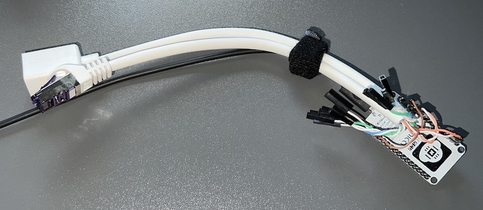
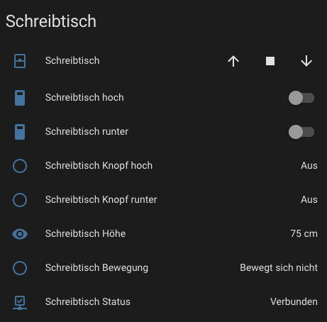
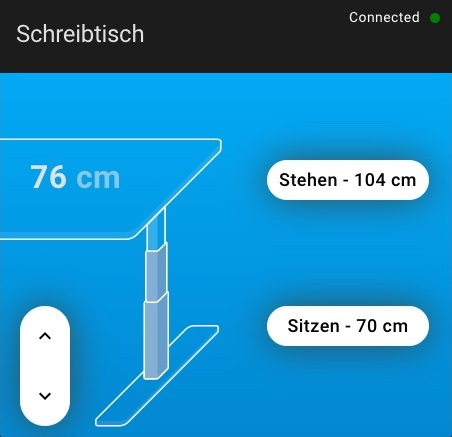

# Smartdesk

A while ago I purchased a height-adjustable desk on the internet. I didn't do much research on possible controlling them using e.g. Home Assistant. My main priority was a corner desk of a certain size. My desk is equipped with a system named ECS+ from [ROL ERGO](https://www.rolergo.com). This company seems to an OEM manufacturer as many different desks are soled with their systems, e.g. Ikea is using their system for the RODULF height-adjustable desk. That being the case, this project should work with RODULF desk, as flotomation showed here and here. His posts actually made me think about automating my desk as well as writing this summary.

Since I'm a [Home Assistant](https://www.home-assistant.io/) user I sticked to the common approach of using [ESPHome](https://esphome.io/) on a NodeMCU with ESP8266. I'm sure this could also be done using Tasmota or being integrated with other systems.

> **Note**
>Please be aware that the control of the desk might get out of sync, especially if you are going to use the time based cover and often restart Home Assistant and/or the ESPHome device. Since there is no measured feedback of the current height the calculated values might not match reality.

---

## Components of my desk

Please see for reference the components of my desk:

- ROL ERGO ECS+ Controller (Part No. 68003670)
- ROL ERGO ECS+ Handset Basic (Part No. 68005680)
- ROL ERGO Drive Unit (Part No. 68006615)

While I'm using this with the ROL Ergo ECS+ system, there is other desks like the IKEA RODULF using similar or same system components.

---

## Hardware needed

Please see the additional hardware I used for my desk:

- Short RJ45 Cat 5/6/7 extension cable - 5€
- NodeMCU v3.2 - ESP8266 Dev Kit - 7€
- Power Supply - 5-10€
- Case - 5€ or if you can just 3d print one.

---

## Tools needed

- Electric soldering iron or
- Dupont crimp tool and connectors
- wire cutter

---

## Hijacking the Connection

To control the desk we simulate the button pushes on the manual controller using the NodeMCU. Since ROL uses a common RJ45 connector we can use a short extension cord and cut it in half without having to destroy the original connectors. I've crimped Dupont connectors to each of the wires, which allowed easy prototyping and testing. Of course, you can also solder the wires directly to the NodeMCU. Just make sure to verify the color coding of the extension cable, which can be different.



The ROL ECS+ Handset uses 3 wires of the RJ45:

|Pin|Wire color|Function|RJ45 Color (in my case!)|
|---|---|---|---|
|2|white|Down|prange|
|5|red|Up|white (from Blue)|
|8|green|Ground|brown|

In my case I can connect:

- White to Brown to move the desk up
- Orange to Brown to move the desk down

### ROL ERGO ECS+ Handset RJ45 Connector

For reference, please see the wire connected in the handset:

|Pin|Wire color|
|---|---|
|1|green|
|2|empty|
|3|empty|
|4|red|
|5|empty|
|6|empty|
|7|white|
|8|empty|

## ESPHome

---

Flotomation only published partial pictures of his code on Instagram, [here you can find my version](sourcecode/smartdesk.yaml) which is based on his ideas and exploration. Please review the entire code before using it, you will need to:

- Adjust _platform_ and _board_ matching your ESP
- Secrets for e.g., Wifi
- _espname_ and _friendly_name_ substitutions
- the _PIN_ numbers matching your ESP setup / configuration
- the timing for _open_duration_ and _close_duration_

---

## Home Assistant

While ESPHome is taking care on registering the configured buttons, sensors and cover component you can enhance the setup with the [LinakDesk Card](https://github.com/IhorSyerkov/linak-desk-card). I've installed the card using [Home Assistant Community Store (HACS)](https://hacs.xyz/) and configured it as follows:

```yaml
type: custom:linak-desk-card
name: "Schreibtisch"
desk: cover.schreibtisch
height_sensor: sensor.desk_height
moving_sensor: binary_sensor.schreibtisch_moving
connection_sensor: binary_sensor.schreibtisch_status
min_height: 75
max_height: 104
presets:
  - label: "Stehen"
    target: 104
  - label: "Sitzen"
    target: 75
```

As you can see the card configuration using a _height_sensor_ and a _moving_sensor_ which are mandatory. The ESPHome cover configuration is not providing these, you can setup template sensors (make sure to adjust the formula of the height sensor):

```yaml
sensor:
# sensor.schreibtisch_height
- platform: template
  sensors:
    schreibtisch_height:
      friendly_name: 'Schreibtisch Höhe'
      unit_of_measurement: 'cm'
      value_template: "{{ (state_attr('cover.schreibtisch', 'current_position') | int * 0.30) | round(0) + 76 }}"

# binary_sensor.schreibtisch_moving
- platform: template
  sensors:
    schreibtisch_moving:
      friendly_name: "Schreibtisch Bewegung"
      device_class: moving
      entity_id:
        - switch.schreibtisch_hoch
        - switch.schreibtisch_runter
      value_template: "{{ 'on' if is_state('switch.schreibtisch_hoch', 'on') or is_state('switch.schreibtisch_runter', 'on') else 'off' }}"
```

Please also make sure to check all the entity id references, as they depend on your configured ESPHome _friendly_name_. When everything aligns you might end up with a Home Assistant controllable desk and a lot of buttons and sensors:



If you configured the LinakDesk Card you will have this one available as well:



---

## The Case

I'm looking to add a 3D printed case to make it look nice. Since I'm lacking a 3D printer it will be added later.

---

## References

- _Flotomation_ Instagram posts [1](https://www.instagram.com/p/CZb1oQZN-WQp) and [2](https://www.instagram.com/p/CZNA9K9tmet/)
- [LinakDesk Card by @IhorSyerkov](https://github.com/IhorSyerkov/linak-desk-card)
- [Home Assistant](https://www.home-assistant.io/)
- [ESPHome](https://esphome.io/)

---

## Feedback & Contributions

Please open issues for Feedback, contributions are welcome as well. ;-)
